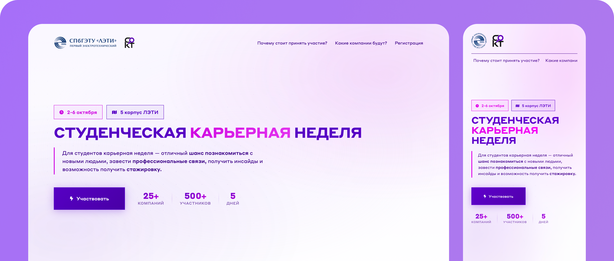

# Career Week 2023 (SOKT & ETU)

This web application was custom-built for the **Student Office of Career and Employment (SOKT)** at **Saint Petersburg Electrotechnical University (ETU "LETI")** to manage and coordinate **Career Week 2023**.

The project is a production-proven, relatively large-scale system that successfully processed and managed registrations and check-ins for **over 500 participants** during the event.

🎨 **Figma Design Mockup:** [View Design Prototype](https://www.figma.com/proto/MMLwnbxzHmhgQdsvdq7Hr4/Дизайн-макет-%22Студенческая-карьерная-неделя%22?node-id=72-23&t=izb5W4sBkdJE2Frz-1&scaling=scale-down-width&content-scaling=fixed)

---

## Key Features

* **Participant Registration:** A public registration form with WTForms validation, dropdown selects, and data sanitation.
* **Local QR Code Generation:** On-the-fly ticket generation as QR codes directly on the backend server, eliminating external API dependencies.
* **Email Ticket Delivery:** Automatic email notifications containing personalized invitations and QR ticket images.
* **Organizer Check-in Tools (for SOKT Staff):**
  * **Built-in QR Scanner:** A dedicated `/scanner` page using client-side camera access to scan ticket QR codes instantly.
  * **Visitor Verification & Logging:** An admin check-in page `/check` to instantly verify participant details and mark their attendance in real time.
* **Secure Admin Dashboard:** A protected administrative interface (`/admin/info`) secured with HTTP Basic Authentication to let staff view, filter, search, and export participant data.

---

## Technology Stack

### Backend
* **Python 3** & **Flask** (Core application framework)
* **Flask-SQLAlchemy** (Database ORM)
* **Flask-Admin** (Administrative dashboard)
* **Flask-Mail** (SMTP email delivery)
* **WTForms** (Form validation and parsing)
* **python-dotenv** (Environment variable configuration)

### Frontend
* **HTML5** & **CSS3 (SCSS)** (Responsive layout and design)
* **jQuery** & **Owl Carousel** (Interactive elements and partner company slider)
* **html5-qrcode** (JavaScript library for browser-based QR code scanning)
* **FontAwesome 6** (Vector icons)

### Database & Helpers
* **SQLite** (Persistent local storage)
* **qrcode** & **Pillow** (Local QR code generation and image rendering libraries)

---

## Project Structure

* `main.py` — Application entry point, database auto-initialization, and admin panel security.
* `requirements.txt` — Python package dependencies.
* `.env.example` — Environment variables configuration template.
* `app/` — Application source code:
  * `__init__.py` — Initialization of the Flask app and extensions (SQLAlchemy, Migrate, Mail, Admin).
  * `config.py` — Configuration loading from environment variables.
  * `models.py` — Database schema (model `User`).
  * `forms.py` — WTForms schemas with validation.
  * `routes.py` — App routing (`/`, `/success`, `/qr`, `/scanner`, `/check`).
  * `templates/` — HTML templates.
  * `static/` — Static assets (CSS, JS, images, fonts).
